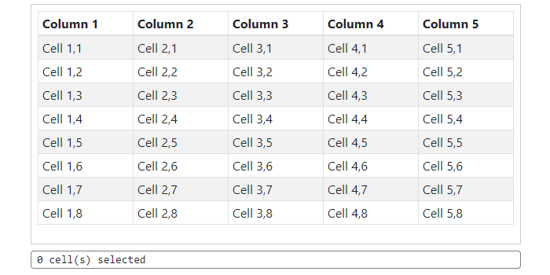

# Noose #

Simple lasso (noose) tool in vanilla JavaScript. Inspired by jQuery UI's [selectable](https://jqueryui.com/selectable/). Supports modern browsers and mobile.

    

`Noose` is kept simple for performance. Its only purpose is to calculate the region to render and then determine the elements to mark as selected. No CSS is provided, styling is left to the user. Checkout the [documentation](https://tokafew420.github.io/noose/documentation.html) for details and code examples.

## Documentation ##
Go to [https://tokafew420.github.io/noose/](https://tokafew420.github.io/noose/documentation.html) for usage, api, and examples.

## Alternatives ##
- jQuery UI selectable - https://jqueryui.com/selectable/
- DragSelect - https://thibaultjanbeyer.github.io/DragSelect/
- ngx-drag-to-select - https://github.com/d3lm/ngx-drag-to-select
- Selectable.js - https://github.com/Mobius1/Selectable
